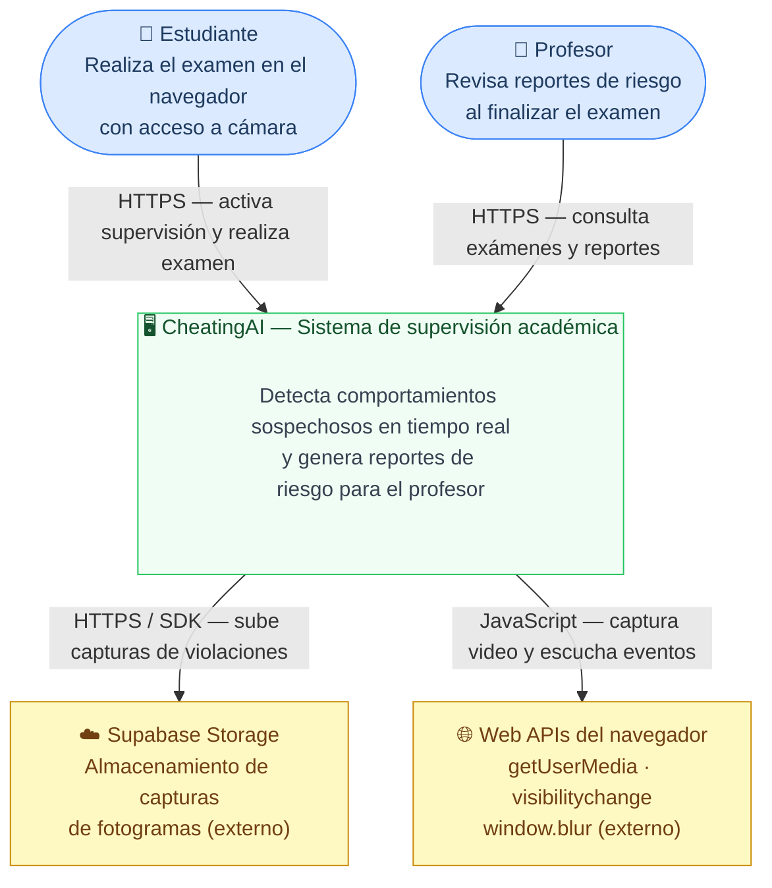
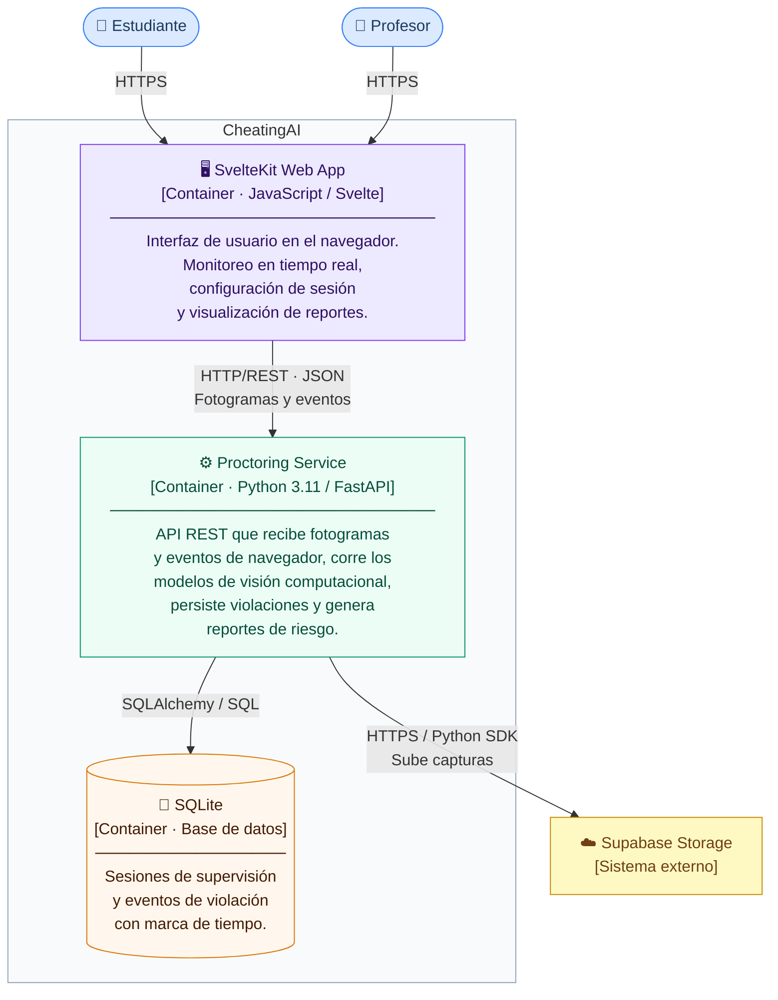
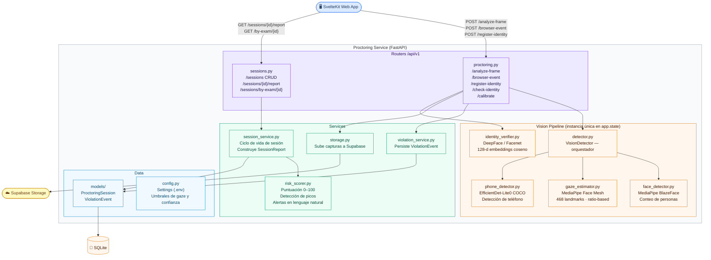
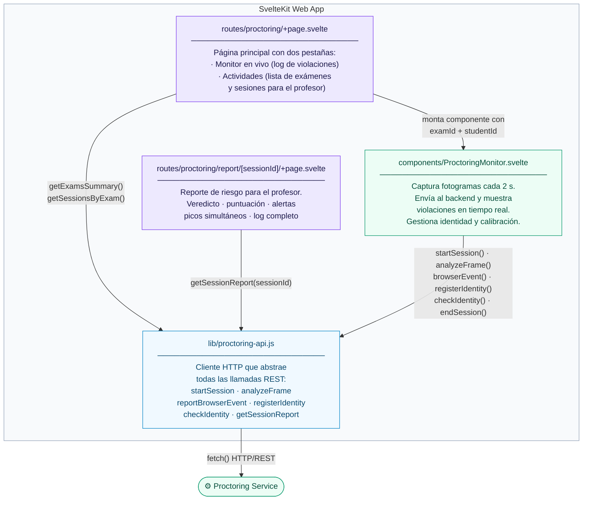
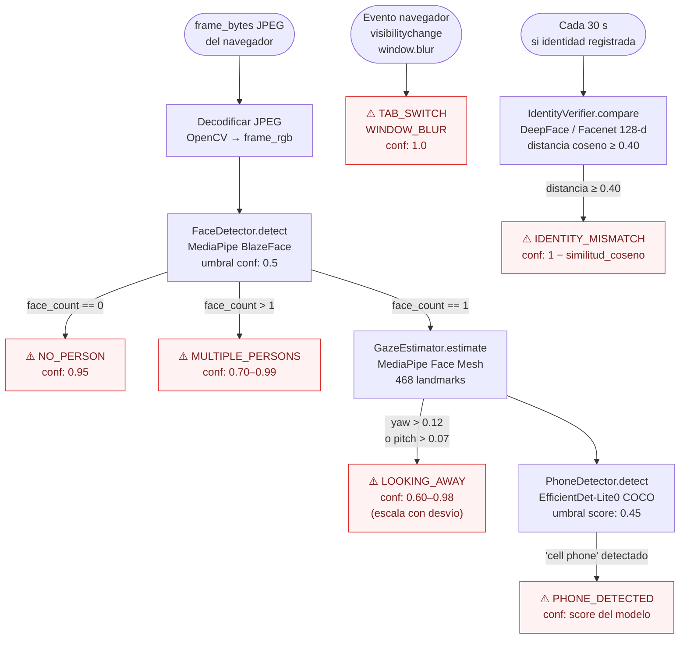
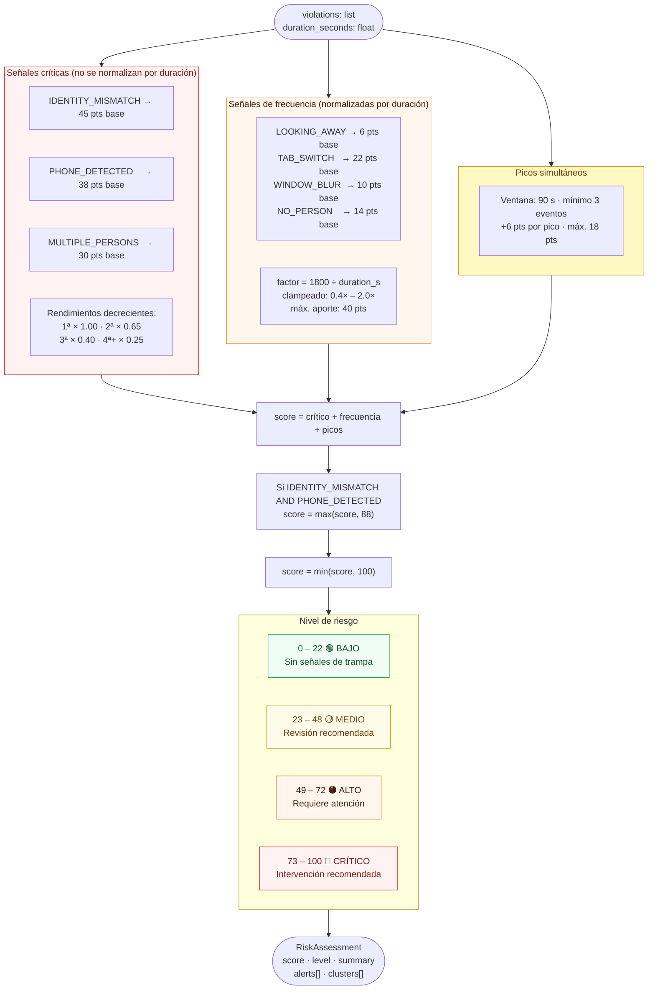
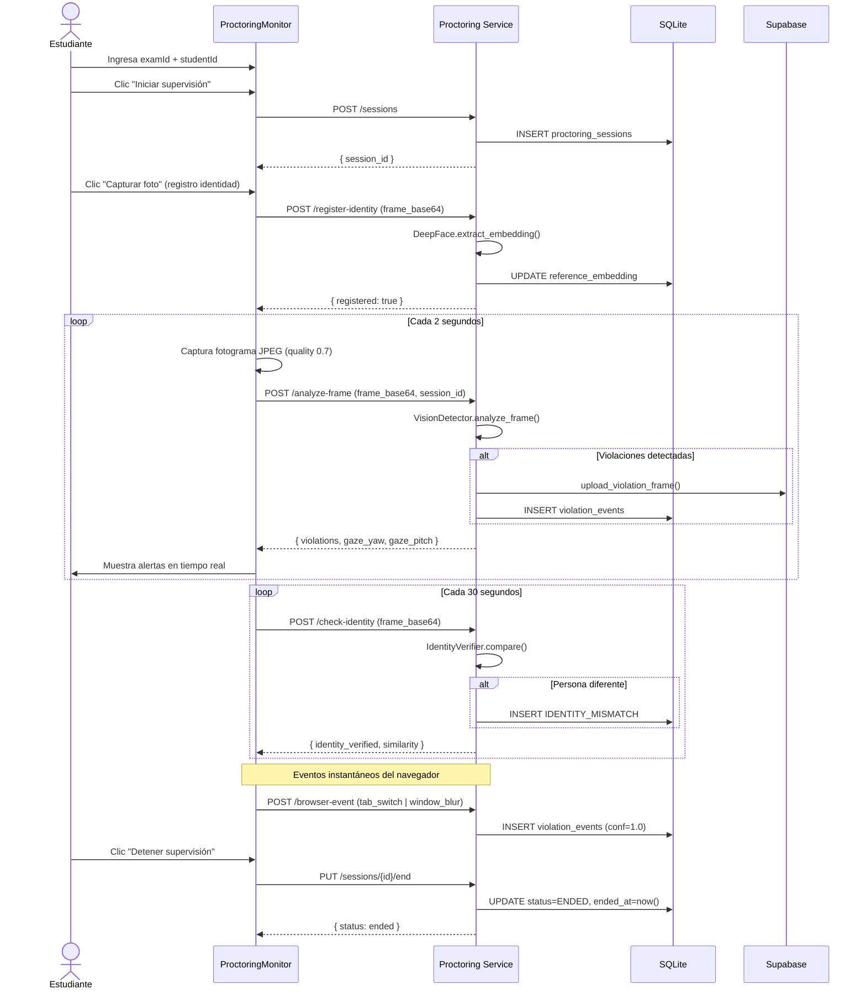
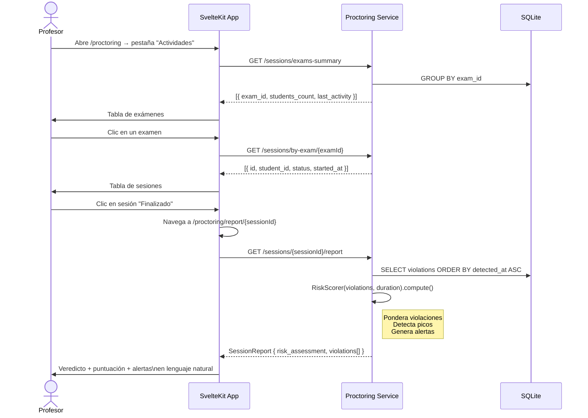

# Arquitectura del sistema — CheatingAI

Documentación de arquitectura siguiendo el **modelo C4** (Context → Container → Component → Code).

> **Convención de lectura:** cada nivel amplía el detalle del anterior. Si solo necesitas entender qué hace el sistema, lee el Nivel 1. Si necesitas entender cómo está construido, lee hasta el Nivel 3.

---

## Nivel 1 — Contexto del sistema

Muestra quiénes usan el sistema y con qué sistemas externos interactúa.



### Actores

| Actor | Rol en el sistema |
|-------|------------------|
| **Estudiante** | Inicia sesión de supervisión, es monitoreado durante el examen |
| **Profesor** | Accede a la vista de actividades y revisa reportes de riesgo por sesión |

### Sistemas externos

| Sistema | Uso |
|---------|-----|
| **Supabase Storage** | Almacena las capturas de fotogramas (`session_id/timestamp.jpg`) cuando se detecta una violación. Opcional: si no está configurado, el sistema funciona sin capturas. |
| **Web APIs del navegador** | `getUserMedia` para acceder a la cámara; `visibilitychange` y `window.blur` para detectar cambios de pestaña y pérdida de foco |

---

## Nivel 2 — Contenedores

Muestra las aplicaciones y procesos que componen CheatingAI.



### Decisiones tecnológicas

| Contenedor | Tecnología | Motivo |
|-----------|------------|--------|
| **Frontend** | SvelteKit | Bundle mínimo, reactividad sin framework pesado, acceso directo a Web APIs |
| **Proctoring Service** | FastAPI + Python | Ecosistema de ML (MediaPipe, DeepFace, OpenCV) disponible nativamente en Python |
| **Base de datos** | SQLite | Sin infraestructura adicional en desarrollo; sustituible por PostgreSQL en producción solo cambiando `DATABASE_URL` |
| **Modelos de visión** | MediaPipe (Google) | On-device, sin coste por llamada a API, latencia ~50–100 ms por fotograma |

---

## Nivel 3 — Componentes del Proctoring Service

Muestra los módulos internos del backend y sus responsabilidades.



---

## Nivel 3 — Componentes del Frontend (SvelteKit)



---

## Nivel 4 — Código: estructuras clave

### Modelos de datos (SQLAlchemy)

```
ProctoringSession                    ViolationEvent
─────────────────────────────        ──────────────────────────────────
id              : UUID (PK)          id              : UUID (PK)
exam_id         : str                session_id      : FK → ProctoringSession
student_id      : str                violation_type  : ViolationType (enum)
status          : SessionStatus      confidence      : float  [0.0 – 1.0]
started_at      : datetime (UTC)     frame_snapshot  : str?  (Supabase URL)
ended_at        : datetime? (UTC)    detected_at     : datetime (UTC)
reference_embedding : str? (JSON)
                                     ↑ relación 1-N
```

**ViolationType (enum)**
```
IDENTITY_MISMATCH | PHONE_DETECTED | MULTIPLE_PERSONS
TAB_SWITCH        | NO_PERSON      | WINDOW_BLUR       | LOOKING_AWAY
```

---

### Pipeline de visión (por fotograma)



---

### Motor de riesgo (RiskScorer)



---

## Flujos principales

### Flujo de monitoreo (estudiante)



---

### Flujo de reporte (profesor)



---

## Configuración y variables de entorno

El servicio se configura con un archivo `.env` en `proctoring_service/`:

| Variable | Valor por defecto | Descripción |
|----------|------------------|-------------|
| `DATABASE_URL` | `sqlite:///./data/proctoring.db` | Conexión a la base de datos |
| `SUPABASE_URL` | `""` | URL del proyecto Supabase (opcional) |
| `SUPABASE_SERVICE_KEY` | `""` | Service role key de Supabase (opcional) |
| `SUPABASE_BUCKET` | `proctoring-violations` | Nombre del bucket de Storage |
| `GAZE_YAW_THRESHOLD` | `0.12` | Desviación horizontal máxima (fracción del ancho de cara) |
| `GAZE_PITCH_THRESHOLD` | `0.07` | Desviación vertical máxima (fracción de la altura de cara) |
| `FACE_DETECTION_CONFIDENCE` | `0.5` | Umbral de confianza de BlazeFace |
| `FACE_MESH_CONFIDENCE` | `0.5` | Umbral de confianza de Face Mesh |

---

## Estructura de directorios

```
CheatingAI/
├── client/                              # SvelteKit Web App
│   └── src/
│       ├── lib/
│       │   ├── proctoring-api.js        # Cliente HTTP
│       │   └── components/
│       │       └── ProctoringMonitor.svelte
│       └── routes/
│           └── proctoring/
│               ├── +page.svelte         # Monitor + Actividades
│               └── report/[sessionId]/
│                   └── +page.svelte     # Reporte de riesgo
│
├── proctoring_service/                  # FastAPI Backend
│   ├── requirements.txt
│   └── app/
│       ├── main.py                      # Entrypoint FastAPI
│       ├── config.py                    # Settings (.env)
│       ├── database.py                  # SQLAlchemy engine
│       ├── dependencies.py              # get_db()
│       ├── models/
│       │   ├── session.py               # ORM: ProctoringSession
│       │   └── violation.py             # ORM: ViolationEvent
│       ├── schemas/
│       │   ├── session.py               # Pydantic: SessionReport, RiskAssessmentSchema
│       │   ├── violation.py             # Pydantic: ViolationWithSnapshot
│       │   └── frame.py                 # Pydantic: FrameAnalysisRequest/Response
│       ├── routers/
│       │   ├── proctoring.py            # /analyze-frame, /browser-event, /identity
│       │   └── sessions.py              # /sessions CRUD + /report
│       └── services/
│           ├── session_service.py       # Lógica de sesiones y reportes
│           ├── risk_scorer.py           # Motor de puntuación de riesgo
│           ├── violation_service.py     # Persistencia de violaciones
│           ├── storage.py               # Upload a Supabase
│           └── vision/
│               ├── detector.py          # VisionDetector (orquestador)
│               ├── face_detector.py     # MediaPipe BlazeFace
│               ├── gaze_estimator.py    # MediaPipe Face Mesh
│               ├── phone_detector.py    # EfficientDet-Lite0
│               └── identity_verifier.py # DeepFace / Facenet
│
├── ARCHITECTURE.md                      # Este documento
└── CRITERIOS_DE_RIESGO.md               # Criterios de evaluación de trampa
```
