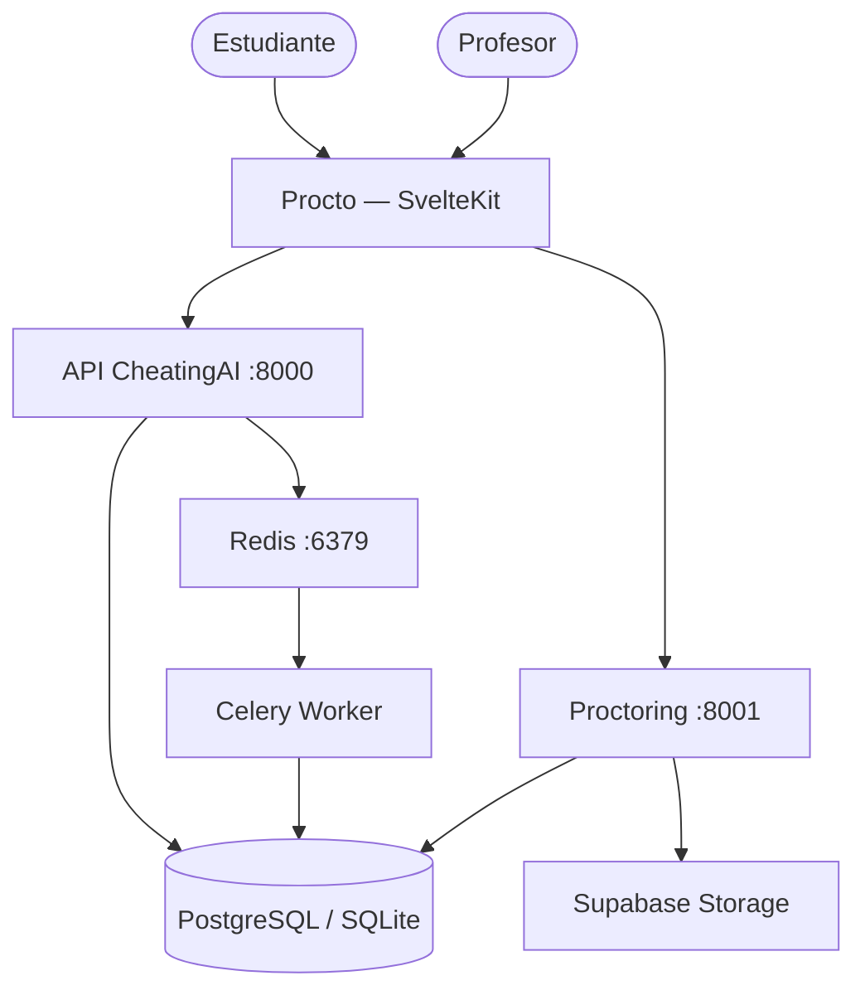
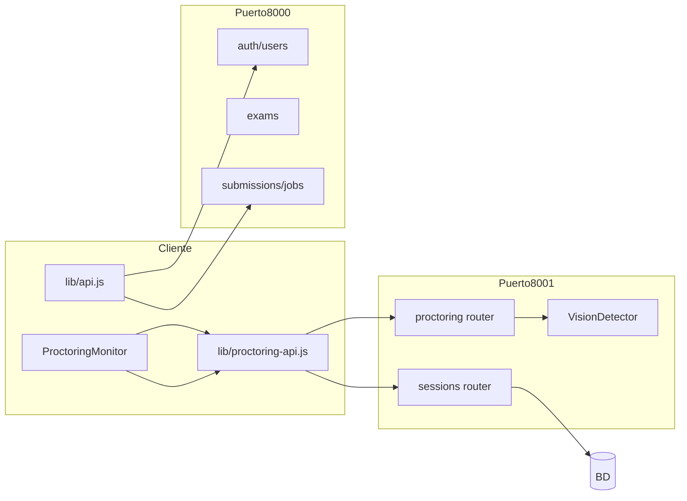
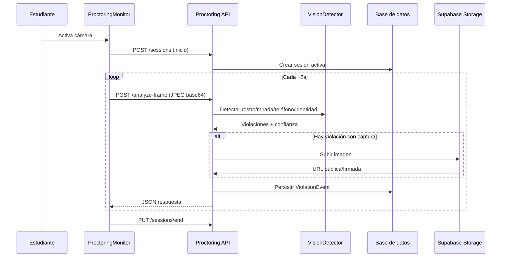
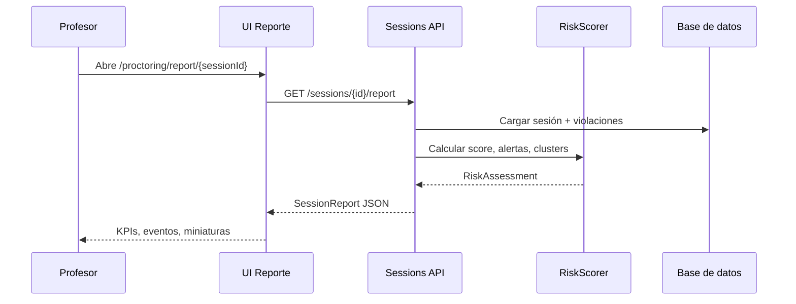

# Guía para el informe del proyecto

## 1. Introducción

La evaluación académica en entornos virtuales ha crecido de forma sostenida, pero la supervisión directa del docente se reduce frente al aula presencial. Esa brecha facilita conductas de riesgo (consulta no autorizada, dispositivos móviles, terceros en el encuadre, cambio de pestaña) y dificulta la revisión posterior por falta de evidencia estructurada.

**CheatingAI** (interfaz **Procto**) es la respuesta técnica desarrollada en el Proyecto Final de Grado de la Universidad del Norte. El sistema combina:

- **Proctoring** (núcleo del informe): análisis de fotogramas y eventos del navegador, persistencia de violaciones, capturas puntuales en Supabase Storage y reportes de riesgo para el profesor.
- **Módulo de plagio en código**: comparación de entregas con Winnowing, trabajos asíncronos vía Celery/Redis y UI de entregas, análisis y cola de trabajos.
- **Capa transversal**: autenticación JWT, gestión de exámenes, roles profesor/estudiante y cliente web SvelteKit 5.

**Situación actual del prototipo:** los servicios FastAPI (`api` en :8000, `proctoring` en :8001), el frontend Procto, la integración con Postgres/Supabase y Docker Compose están operativos para demostración y validación. El diseño detallado en C4 se amplía en [ARCHITECTURE.md](./ARCHITECTURE.md); los criterios del score de riesgo en [CRITERIOS_DE_RIESGO.md](./CRITERIOS_DE_RIESGO.md).

## 2. Marco conceptual

| Concepto | Definición en el proyecto |
|----------|---------------------------|
| **Proctoring** | Supervisión remota durante un examen mediante cámara web y señales del navegador (foco, visibilidad de pestaña). |
| **Violación / evento** | Registro tipificado (`no_person`, `multiple_persons`, `looking_away`, `phone_detected`, `tab_switch`, `window_blur`, `identity_mismatch`) con timestamp y confianza. |
| **Sesión de supervisión** | Instancia asociada a `exam_id` y `student_id` con inicio, fin y estado (activa/finalizada). |
| **Evidencia puntual** | Captura de fotograma almacenada en bucket de objetos (p. ej. `violation-captures`), referenciada en el evento — no video continuo. |
| **Score de riesgo** | Valor 0–100 y nivel (bajo/medio/alto/crítico) generados por reglas y agregación temporal; ver [CRITERIOS_DE_RIESGO.md](./CRITERIOS_DE_RIESGO.md). |
| **Visión por computador** | Pipeline en servidor: detección de rostros (MediaPipe BlazeFace), estimación de mirada (Face Mesh), teléfono (EfficientDet-Lite), identidad (DeepFace/Facenet vs foto de perfil). |
| **API-first** | Toda la lógica expuesta por REST; el cliente Procto es consumidor, no requisito para operar la API. |
| **Winnowing** | Algoritmo de huellas para comparar similitud entre códigos fuente (módulo plagio). |

## 3. Planteamiento del problema

El problema central es la **falta de herramientas integradas** que ayuden al docente a supervisar exámenes virtuales con evidencia verificable y señales interpretables, sin depender únicamente de grabaciones extensas o bloqueos rígidos del navegador.

### 3.1 Descripción del problema

**Causas:** modalidad remota, asimetría de información entre estudiante y evaluador, disponibilidad de recursos digitales durante la prueba y limitaciones de las plataformas LMS para monitoreo conductual.

**Afectados:** docentes y coordinadores académicos (revisión y decisiones), estudiantes (experiencia y equidad del proceso), instituciones (integridad académica y reputación).

**Consecuencias:** revisiones manuales lentas, inconsistencia entre evaluadores, reportes poco accionables, falsos positivos que erosionan confianza y falsos negativos que dejan sin detectar fraude.

### 3.2 Restricciones y supuestos de diseño

**Restricciones técnicas:**

- Uso de cámara web estándar del estudiante; sin hardware dedicado.
- Procesamiento en **CPU** en el servicio de proctoring (MediaPipe no es fork-safe: **un worker** Uvicorn).
- Frecuencia de análisis acotada en cliente (p. ej. cada 2 s) para equilibrar latencia y carga.
- Privacidad: no almacenar video completo; evidencia puntual y eventos.
- Dependencia de iluminación, ángulo y calidad de cámara para visión e identidad.
- Integraciones externas (Supabase) sujetas a configuración correcta de `DATABASE_URL` y claves.

**Supuestos:**

- Navegador moderno con `getUserMedia` y permisos de cámara otorgados manualmente.
- Conectividad estable hacia API y Storage.
- Las alertas son **probabilísticas**; la decisión académica es humana.
- Foto de referencia del estudiante disponible para verificación de identidad (registro/perfil).

**Nota de evolución:** la ficha inicial del proyecto indicaba no realizar identificación biométrica; la implementación actual incluye **verificación de identidad** en el backend (`identity_mismatch` con captura comparativa), documentada como ampliación del alcance funcional.

### 3.3 Alcance

**Dentro del alcance (entregado):**

- Auth JWT, exámenes, código de acceso, sesiones de proctoring, análisis de frames, eventos de navegador, reportes con KPIs y evidencia.
- UI Procto (login, registro con foto estudiante, perfil, exámenes, unirse, supervisión, reporte, entregas/análisis/trabajos).
- Módulo plagio: submissions, análisis par a par y por lote, jobs con Celery.
- Despliegue local con Docker Compose.

**Fuera del alcance (esta fase):**

- Integración nativa con LMS (Moodle, Canvas).
- Sanción automática (expulsión) sin revisión humana.
- Análisis de audio o de contenido de pantalla sin screen sharing explícito.
- Detección fiable de múltiples monitores solo con APIs del navegador.

## 4. Objetivos

**Objetivo general:** Desarrollar un sistema que apoye la integridad académica en evaluaciones virtuales mediante supervisión por cámara y navegador, detección de similitud de código y una interfaz unificada, generando evidencia y reportes accionables.

**Objetivos específicos:**

| ID | Objetivo | Indicador de cumplimiento |
|----|----------|---------------------------|
| OE-01 | Registrar sesiones con examen, estudiante y estado | API `POST/PUT /sessions`, persistencia en BD |
| OE-02 | Detectar señales CV en fotogramas | Tipos `no_person`, `multiple_persons`, `looking_away`, `phone_detected` |
| OE-03 | Registrar eventos de navegador | `tab_switch`, `window_blur` |
| OE-04 | Almacenar evidencia puntual ante violaciones | URL en `frame_snapshot` (Supabase) |
| OE-05 | Generar reporte con score 0–100 y alertas | `GET /sessions/{id}/report` |
| OE-06 | Ofrecer UI Procto por roles | Rutas profesor/estudiante operativas |
| OE-07 | Comparar entregas de código (plagio) | Jobs Winnowing y resultados en UI |
| OE-08 | Validar con pruebas automatizadas e integración | `pytest` en proctoring; build del cliente |

## 5. Estado del arte / soluciones relacionadas

| Solución | Enfoque | Ventajas | Limitaciones |
|----------|---------|----------|--------------|
| **Proctorio / Honorlock / Examity** | SaaS: webcam, bloqueo, a veces grabación | Madurez comercial, soporte | Costo recurrente, intrusividad, poca transparencia del scoring |
| **Respondus LockDown Browser** | Bloqueo fuerte del navegador | Reduce pestañas | Poca analítica conductual frente a cámara |
| **Enfoques académicos (CV)** | Mirada, pose, objetos, reglas | Control del pipeline | Requiere calibración y revisión humana |
| **CheatingAI / Procto** | API propia + CV en servidor + score explicable | Evidencia puntual, despliegue Docker, código abierto en repo | Calibración por entorno; dependencia de Supabase en producción |

**Oportunidad de mejora:** reportes que eviten trivialidad (score + razones + clusters temporales + capturas), alineado con `informe2.md` y la implementación del motor `risk_scorer`.

## 6. Requerimientos

### 6.1 Funcionales

**Proctoring y sesiones**

- **RF-01:** Autenticación y roles (profesor / estudiante).
- **RF-02:** CRUD de exámenes y verificación de código de acceso.
- **RF-03:** Iniciar y finalizar sesión de supervisión.
- **RF-04:** Analizar fotogramas (`analyze-frame`) y persistir violaciones.
- **RF-05:** Registrar eventos de navegador.
- **RF-06:** Verificar identidad vs foto de perfil (`identity_mismatch`).
- **RF-07:** Listar sesiones por examen y generar reporte detallado.
- **RF-08:** Subir foto de perfil en registro/perfil (estudiante).

**Plagio**

- **RF-09:** Crear y listar entregas de código (`submissions`).
- **RF-10:** Análisis par a par y por lote (jobs Celery).
- **RF-11:** Consultar estado y resultados de trabajos.

**Frontend Procto**

- **RF-12:** Flujos UI para todos los RF anteriores según rol.

### 6.2 No funcionales

- **RNF-01 Rendimiento:** latencia estable por frame en CPU; intervalo configurable en cliente.
- **RNF-02 Escalabilidad:** PostgreSQL/Supabase para concurrencia; un worker en proctoring por MediaPipe.
- **RNF-03 Seguridad:** JWT, `.env` no versionado, claves de servicio en Supabase.
- **RNF-04 Privacidad:** sin video completo; capturas puntuales.
- **RNF-05 Usabilidad:** interfaz Procto (shadcn-svelte), reportes legibles.
- **RNF-06 Mantenibilidad:** servicios separados, documentación C4.
- **RNF-07 Confiabilidad:** degradación si falla Storage (eventos sin URL de captura).
- **RNF-08 Calidad:** umbrales calibrables; pruebas `pytest`.

## 7. Diseño y arquitectura

### 7.1 Evaluación de alternativas

| Decisión | Alternativas | Criterios | Selección |
|----------|--------------|-----------|-----------|
| Persistencia | SQLite / PostgreSQL | Concurrencia, despliegue | SQLite dev; **PostgreSQL/Supabase** prod |
| Evidencia | MinIO / Supabase Storage | Operación, costo | **Supabase Storage** |
| Visión | OpenCV clásico / MediaPipe | Precisión, CPU | **MediaPipe** + EfficientDet-Lite |
| Procesamiento frames | Cliente / Servidor | Seguridad, consistencia | **Servidor** |
| Frontend | SPA varias / SvelteKit | Bundle, DX | **SvelteKit 5** |
| Plagio async | Síncrono / Celery+Redis | Tiempo de respuesta | **Celery + Redis** |
| Microservicio proctoring | Monolito / Separado | Aislamiento ML | **Servicio :8001** |

### 7.2 Arquitectura

#### 7.2.1 Descripción general de la arquitectura

Arquitectura **cliente-servidor** en tres capas:

1. **Cliente Procto** (SvelteKit, puerto 5173 en desarrollo): captura cámara, envía frames, muestra reportes.
2. **API principal** (:8000): auth, usuarios, exámenes, submissions, jobs de plagio.
3. **Servicio proctoring** (:8001): visión, sesiones, reportes de riesgo.
4. **Persistencia:** PostgreSQL/SQLite + Supabase Storage.
5. **Cola:** Redis + worker Celery (plagio) + Flower (:5555).

#### 7.2.2 Componentes del sistema e interacción

##### 7.2.2.1 Descripción de componentes

| Componente | Responsabilidad | Requerimientos |
|------------|-----------------|----------------|
| **client/** | UI Procto, proxy Vite a APIs | RF-12, RNF-05 |
| **app/** | API plagio, auth, exámenes | RF-01, RF-09–11 |
| **proctoring_service/** | CV, sesiones, reportes | RF-03–07 |
| **Redis + worker** | Cola plagio | RF-10–11 |
| **Supabase** | BD Postgres + Storage | RF-06, RNF-03 |

**Diagrama de arquitectura del sistema:**

La arquitectura separa el pipeline de visión (carga CPU, modelos pesados) del API de plagio, permitiendo escalar y desplegar cada servicio de forma independiente.

##### 7.2.2.2 Interacción entre módulos

- El **cliente** usa `vite.config.js` para enrutar `/api/v1/proctoring` y `/api/v1/sessions` al puerto 8001; el resto de `/api` al 8000.
- **JWT** emitido por `app` se reutiliza en llamadas al servicio de proctoring.
- **Violaciones** se escriben en BD del proctoring; **capturas** se suben a Supabase y la URL se guarda en el evento.
- **Jobs de plagio:** API encola en Redis; worker persiste resultados consultables desde la UI.

**Diagrama de interacción entre módulos:**

El acoplamiento es **mediado por HTTP y contratos REST**; no hay dependencia compile-time entre `app` y `proctoring_service`.

##### 7.2.2.3 Comportamiento

**Eficiencia y latencia:** el cuello de botella principal es el análisis de visión por frame (~50–100 ms en CPU). El cliente limita la frecuencia (2 s), lo que evita saturar el servidor en salas pequeñas. Los pasos de subida a Storage son asíncronos respecto a la respuesta del análisis cuando la implementación lo permite.

**Desacoplamiento:** correcto entre UI y servicios; el guard síncrono en `/proctoring` (Svelte) evita flash de redirect — decisión de UX documentada en el código.

**Diagrama de secuencia — supervisión (analyze-frame):**

**Diagrama de secuencia — consulta de reporte:**

## 8. Implementación

### 8.1 Stack tecnológico

| Capa | Tecnología | Justificación |
|------|------------|---------------|
| Frontend | SvelteKit 5, Vite, shadcn-svelte, Tailwind v4 | UI reactiva liviana, componentes accesibles |
| API principal | Python 3.11, FastAPI, SQLAlchemy, Celery | Ecosistema ML/plagio, OpenAPI |
| Proctoring | FastAPI, MediaPipe, OpenCV, DeepFace | Pipeline CV en Python |
| BD | PostgreSQL (Supabase) / SQLite | Prod vs dev |
| Cola | Redis 7, Flower | Jobs de plagio |
| Storage | Supabase buckets | Fotos perfil y violaciones |
| Contenedores | Docker Compose | Reproducibilidad |
| Cliente CV en browser | MediaPipe Tasks Vision | Validación previa en registro (Brave-compatible) |

### 8.2 Componentes

| Módulo | Estado | Funcionalidades |
|--------|--------|-----------------|
| `proctoring_service/` | Operativo | Frames, browser events, identidad, reportes, pytest |
| `app/` | Operativo | Auth, exámenes, submissions, jobs |
| `client/` | Operativo | Procto UI completa, build estático |
| `diseno/` | Documentación | Experimentos rostro, mirada, pose, objetos |

**Diferencias diseño vs implementación:** identidad biométrica añadida en backend; frontend centraliza verificación en `analyze-frame` (no polling duplicado de identidad).

### 8.3 Integraciones

| Integración | Estado | Uso |
|-------------|--------|-----|
| Supabase Postgres | Configurable | `DATABASE_URL` — requiere URI correcta |
| Supabase Storage | Configurable | `violation-captures`, `profile-photos` |
| Redis | Operativo en compose | Broker Celery |
| MediaPipe / DeepFace | Operativo | Carga lazy en proctoring |

## 9. Despliegue y operación

El sistema se ejecuta con **Docker Compose** desde la raíz del repositorio: servicios `redis`, `api` (8000), `worker`, `flower` (5555), `proctoring` (8001). El cliente se sirve en desarrollo con `npm run dev` (5173) o build estático con `npm run build`.

Variables en `.env` (plantilla `.env.example`): `DATABASE_URL`, `JWT_*`, `SUPABASE_*`, `REDIS_URL`. Procedimiento detallado en [Instalación.md](./Instalación.md). Operación: health en `/health`, documentación OpenAPI en `/docs` de cada API.

## 10. Validación

### 10.1 Pruebas por componentes

En `proctoring_service/tests/` con **pytest**:

- Endpoints de sesiones y proctoring con `TestClient`.
- Casos de decodificación de imagen, sesión inactiva, persistencia de violaciones.
- Criterio de éxito: tests pasan (`pytest tests/ -v`); primera ejecución puede tardar por carga de modelos MediaPipe.

### 10.2 Pruebas de integración

Flujos validados manualmente y en compose:

1. `docker compose up --build redis api proctoring` + cliente dev.
2. Login profesor/estudiante → crear examen → código → join → supervisión → reporte.
3. Submissions → análisis → jobs (requiere worker levantado).
4. Manejo de `DATABASE_URL` incorrecta (fallo controlado al arranque; ver Instalación §6).

### 10.3 Pruebas de usabilidad

Tras rediseño UI Procto (shadcn-svelte), checklist recomendado:

- ¿El profesor localiza el reporte y entiende score/alertas en &lt; 3 min?
- ¿El estudiante activa cámara manualmente y completa registro con foto?
- ¿Los mensajes de error (código inválido, examen finalizado) son claros?

Criterio: reporte accionable sin leer UUIDs; evidencia visible en `identity_mismatch`.

## 11. Resultados y discusión

**Resultados alcanzados:**

- Prototipo full-stack demostrable con dos módulos (proctoring + plagio) y UI unificada Procto.
- Pipeline de visión en CPU con múltiples tipos de violación y reporte con score.
- Verificación de identidad con foto de referencia y capturas en Storage.
- Documentación técnica (C4, criterios de riesgo, guías de instalación y desarrollo).

**Limitaciones:**

- Sensibilidad a iluminación y calidad de cámara; falsos positivos en mirada o identidad.
- Un worker en proctoring limita throughput horizontal sin rediseño de carga de modelos.
- Configuración Supabase no trivial (`tenant/user postgres.xxx not found` si URI incorrecta).
- Módulo plagio depende de worker Celery para análisis batch.

**Trabajo futuro:** integración LMS, calibración automática de umbrales por sala, métricas de precisión/recall con dataset etiquetado, despliegue en la nube con CI/CD.

## 12. Referencias

- Google MediaPipe. *MediaPipe Solutions*. https://developers.google.com/mediapipe
- FastAPI. Documentación oficial. https://fastapi.tiangolo.com/
- SvelteKit. Documentación. https://svelte.dev/docs/kit
- Supabase. Documentación (Database, Storage). https://supabase.com/docs
- Schleimer, S., Wilkerson, A., Aiken, A. (2003). *Winnowing: Local Algorithms for Document Fingerprinting.* (algoritmo de plagio)
- shadcn-svelte. https://www.shadcn-svelte.com/
- Documentación de diseño en `diseno/` (detección de rostro, mirada, pose, objetos)
- Repositorio del proyecto: https://github.com/CristhianAC/CheatingAI
