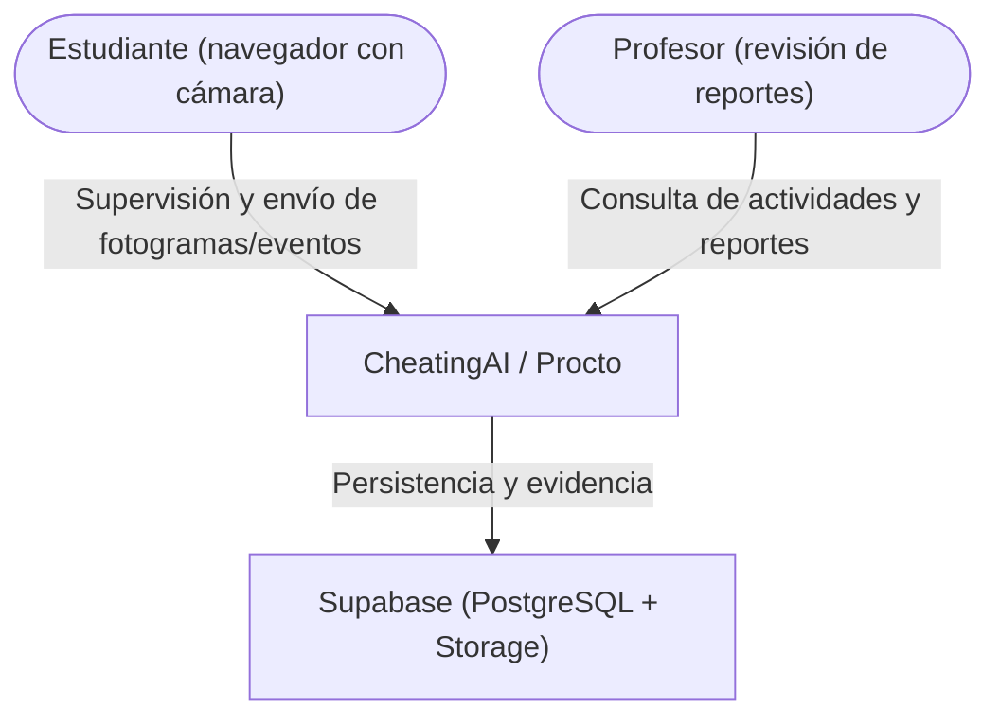
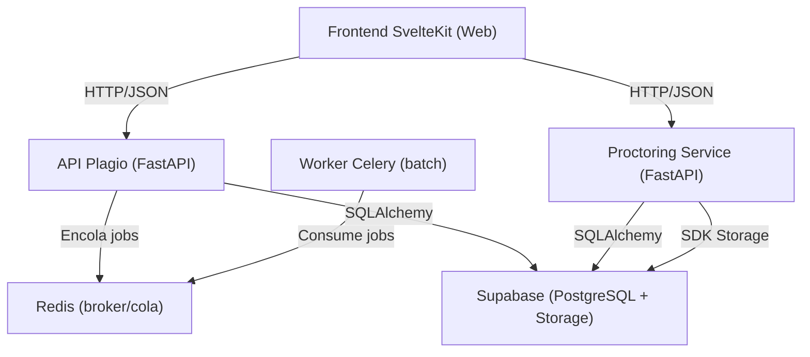

# INFORME 2 — CheatingAI / Procto

## Introducción

CheatingAI (nombre de trabajo; en el cronograma se contempla el rebranding a **Procto**) es un sistema orientado a apoyar la supervisión académica y la detección de irregularidades en evaluaciones virtuales mediante dos líneas complementarias:

- **Detección de similitud de código**: comparación estructural de entregas de programación para identificar posibles casos de plagio aun cuando existan cambios superficiales (por ejemplo, renombrado de variables).
- **Supervisión por cámara y navegador (proctoring)**: análisis de fotogramas y eventos del navegador para registrar comportamientos sospechosos durante un examen, almacenarlos como evidencia y generar reportes comprensibles para docentes.

### Situación actual

El sistema cuenta con una implementación funcional que permite:

- Iniciar y finalizar sesiones de supervisión por examen/estudiante.
- Analizar fotogramas periódicos desde el navegador y detectar señales de riesgo (presencia/ausencia de persona, múltiples personas, mirada desviada, teléfono).
- Registrar eventos del navegador (cambio de pestaña y pérdida de foco) como violaciones con marca de tiempo.
- Almacenar **capturas de evidencia** en **Supabase Storage** cuando se detecta una violación.
- Generar un **reporte por sesión** con score de riesgo (0–100), nivel (bajo/medio/alto/crítico), alertas en lenguaje natural y agrupación de “picos” de comportamiento (clusters).
- Ejecutar análisis batch de plagio mediante una cola asíncrona (Celery + Redis) y monitoreo (Flower).

### Necesidad u oportunidad

En contextos de evaluación remota, el control humano directo se vuelve limitado. La oportunidad consiste en producir:

- **Evidencia concreta** (eventos con timestamp y capturas) para revisión posterior.
- **Señales interpretables** (score y alertas) que reduzcan el tiempo de análisis del docente.
- Un enfoque de detección que no dependa exclusivamente de bloqueo del navegador o grabaciones extensas, sino que integre señales de cámara, navegador y patrones de comportamiento.

---

## Planteamiento del Problema

### a) Descripción del problema

En evaluaciones virtuales, el riesgo de fraude aumenta por factores como:

- Acceso paralelo a recursos externos (pestañas/ventanas adicionales, aplicaciones externas).
- Presencia de terceros durante la evaluación.
- Sustitución de identidad (una persona diferente realizando el examen).
- Uso de dispositivos móviles como fuente de consulta.
- Dificultad para detectar plagio de código cuando el texto ha sido modificado superficialmente.

La problemática afecta principalmente a:

- **Docentes**, que requieren evidencia y señales claras para fundamentar decisiones.
- **Instituciones**, que necesitan reducir riesgo reputacional y asegurar integridad académica.
- **Estudiantes**, que requieren reglas claras y mecanismos que minimicen falsos positivos.

Consecuencias principales:

- Procesos de revisión manual lentos y poco consistentes.
- Reportes “triviales” con datos crudos que no se traducen en decisiones.
- Riesgo de falsos positivos (alertas excesivas o no concluyentes) que deterioran confianza y experiencia de usuario.

### b) Restricciones y supuestos de diseño

Restricciones y condiciones observadas en el proyecto:

- **Ejecución en CPU** (sin requerir GPU) para facilitar adopción.
- Dependencia de **Web APIs** del navegador para captura de cámara y eventos de ventana/pestaña.
- Sensibilidad del desempeño a condiciones reales: iluminación, calidad de cámara, ángulos del rostro, accesorios (gafas, mascarillas).
- Requerimientos de **privacidad**: evitar almacenar video completo; preferir eventos y evidencia puntual.
- Integraciones externas (p. ej. Supabase) sujetas a límites de costo, políticas de acceso y configuración de seguridad.

Supuestos:

- El estudiante utiliza un navegador moderno compatible con `getUserMedia`.
- Existe conectividad estable hacia la infraestructura desplegada.
- Las reglas e indicadores deben interpretarse como apoyo a la decisión, no como sanción automática.

### c) Alcance

Dentro del alcance (implementación actual y roadmap inmediato):

- Supervisión por cámara: detección de señales de riesgo y registro de violaciones.
- Captura y almacenamiento de evidencia puntual (fotogramas) ante violaciones.
- Reporte por sesión con score de riesgo y explicaciones legibles.
- Detección de cambio de pestaña/ventana y pérdida de foco como señales de riesgo.
- Detección de similitud de código con Winnowing y Jaccard, incluyendo batch asíncrono.

Fuera del alcance (en esta fase):

- Integración con LMS (Moodle/Canvas) como plataforma oficial de evaluación.
- Sanción o intervención automática (expulsión/bloqueo) sin revisión humana.
- Detección confiable de **múltiples monitores físicos** únicamente con navegador (limitación técnica; se planifican mitigaciones).
- Análisis de contenido exacto de pantalla del estudiante (salvo que se implemente screen sharing y se definan políticas).

---

## Objetivos

### Objetivo general

Desarrollar un sistema que apoye la integridad académica en evaluaciones virtuales mediante detección de similitud de código y supervisión por cámara/navegador, generando evidencia y reportes accionables para docentes.

### Objetivos específicos (medibles)

- **OE-01**: Registrar sesiones de examen con `exam_id`, `student_id`, inicio/fin y estado (activo/finalizado).
- **OE-02**: Analizar fotogramas periódicos y detectar al menos: ausencia de persona, múltiples personas, mirada desviada y teléfono visible.
- **OE-03**: Registrar eventos del navegador (cambio de pestaña, pérdida de foco) con timestamp durante una sesión activa.
- **OE-04**: Almacenar evidencia puntual (captura) cuando se detecten violaciones y asociarla al evento.
- **OE-05**: Generar reportes por sesión con resumen (conteos), lista de eventos, evidencia y una evaluación de riesgo 0–100.
- **OE-06**: Proveer una interfaz web que permita supervisión en vivo, vista de actividades por examen y reporte detallado por estudiante.
- **OE-07**: Ejecutar comparación de plagio por pares y análisis batch asíncrono con seguimiento de estado y resultados.
- **OE-08**: Reducir falsos positivos mediante umbrales calibrables, reglas de supresión de alertas triviales y mecanismos de revisión humana.

---

## Estado del Arte

El proctoring remoto y la detección de plagio han sido abordados mediante soluciones comerciales y enfoques académicos. Se identifican patrones comunes:

### 1) Soluciones comerciales de proctoring

Ejemplos representativos: **Proctorio**, **Respondus LockDown Browser**, **Honorlock**, **Examity**.

Características frecuentes:

- Bloqueo del navegador (restricción de pestañas, pantalla completa).
- Monitoreo por webcam y/o grabación de pantalla.
- Reportes con banderas/flags y revisión posterior (en algunos casos con revisión humana).

Limitaciones típicas:

- Dependencia de políticas intrusivas (grabación extendida, bloqueo estricto) con fricción en UX.
- Riesgo de falsos positivos cuando se usan reglas rígidas sin contextualización.
- Costos recurrentes por usuario o por examen.

### 2) Herramientas de detección de plagio en programación

Ejemplos representativos: **MOSS**, **JPlag**, **Sherlock**.

Características frecuentes:

- Comparación estructural o tokenizada (más robusta que comparación literal).
- Reportes de similitud por pares y agrupación de sospechosos.

Limitaciones típicas:

- Poca integración con señales de comportamiento durante evaluación.
- Dependencia de configuración por lenguaje/estructura de proyecto.

### 3) Enfoques académicos

En literatura es común encontrar:

- Detección de mirada, presencia, objetos y postura con modelos de visión por computador.
- Fusión de señales (reglas + estadística/ML) para inferir riesgo.
- Mecanismos “human-in-the-loop” para revisión y retroalimentación.

Oportunidades identificadas:

- Convertir datos crudos en **alertas accionables** (explicabilidad).
- Diseñar reportes que eviten trivialidad: score, razones principales, evidencia y agrupación temporal.
- Minimizar almacenamiento de datos sensibles (evidencia puntual en lugar de video completo).

### Tabla comparativa (resumen)

| Enfoque | Señales | Evidencia | Privacidad | Costo | Despliegue |
|---|---|---|---|---|---|
| Proctoring comercial (bloqueo + grabación) | Navegador + webcam | Video/Screen | Alta intrusión | Recurrente | SaaS |
| Plagio de código (MOSS/JPlag) | Código fuente | Reportes de similitud | Medio | Variable | Servicio/On-prem |
| Enfoque propuesto (CheatingAI/Procto) | Cámara + navegador + score | Eventos + capturas puntuales | Menor intrusión (sin video completo) | Controlable | Docker + servicios gestionados |

---

## Requerimientos

### a) Funcionales

- **RF-01**: Iniciar sesión de supervisión asociada a `exam_id` y `student_id`.
- **RF-02**: Finalizar sesión y generar resumen por tipo de violación.
- **RF-03**: Analizar fotogramas y detectar: `no_person`, `multiple_persons`, `looking_away`, `phone_detected`.
- **RF-04**: Registrar violaciones con timestamp y nivel de confianza.
- **RF-05**: Registrar eventos del navegador: `tab_switch` y `window_blur`.
- **RF-06**: Almacenar capturas de evidencia ante violaciones en un sistema de Blob storage y asociar URL al evento.
- **RF-07**: Listar exámenes con número de estudiantes y actividad reciente.
- **RF-08**: Listar sesiones por examen con estado y timestamps.
- **RF-09**: Generar reporte detallado por sesión con:
  - resumen de eventos,
  - evidencia,
  - score de riesgo (0–100),
  - nivel y alertas explicadas.
- **RF-10**: Registrar identidad de referencia por sesión y ejecutar chequeos periódicos (cuando esté habilitado).
- **RF-11**: Subir submissions de código y ejecutar comparación pairwise.
- **RF-12**: Ejecutar análisis batch asíncrono, consultar estado y resultados.

### b) No funcionales

- **RNF-01 Rendimiento**: procesamiento de fotogramas con latencia estable en CPU; frecuencia configurable (p. ej. cada 2 s).
- **RNF-02 Escalabilidad**: soporte para múltiples sesiones concurrentes mediante PostgreSQL (Supabase) y colas para tareas batch.
- **RNF-03 Seguridad**: separación de credenciales en `.env`, rotación de claves y configuración de políticas de acceso en DB/Storage (RLS, bucket privado, URLs firmadas).
- **RNF-04 Privacidad**: evitar almacenamiento de video completo; privilegiar evidencia puntual (capturas) y retención limitada.
- **RNF-05 Usabilidad**: reportes comprensibles y priorizados (no trivialidad); interfaz clara para supervisión y revisión.
- **RNF-06 Mantenibilidad**: modularidad (servicios, routers, schemas) y documentación técnica de arquitectura (C4).
- **RNF-07 Confiabilidad**: manejo de errores y degradación segura (si falla Storage, el sistema continúa registrando eventos).
- **RNF-08 Calidad**: minimizar falsos positivos mediante umbrales calibrables y reglas de supresión de eventos triviales.

---

## Diseño y Arquitectura

### a) Evaluación de alternativas

Decisiones evaluadas en el proyecto:

- **Base de datos**:
  - SQLite: simple para desarrollo, pero con limitaciones de concurrencia.
  - PostgreSQL: estándar en producción; adoptado mediante instancia gestionada (Supabase).
- **Blob storage de evidencia**:
  - MinIO: alternativa auto-hospedada y compatible con S3.
  - Supabase Storage: servicio gestionado; adoptado para simplificar despliegue y evidencia.
- **Modelos de visión**:
  - OpenCV clásico vs MediaPipe: se prioriza MediaPipe por modelos optimizados y pipeline reproducible en CPU.
- **Asincronía**:
  - Procesos síncronos vs Celery + Redis: se usa Celery para batch de plagio, manteniendo la API responsiva.

### b) Arquitectura seleccionada

La arquitectura sigue el modelo **C4**. A continuación se incluye un resumen de dos niveles (Contexto y Contenedores) consistente con el repositorio.

#### Diagrama de contexto (alto nivel)

#### Diagrama de contenedores (implementación)

Justificación resumida:

- Separación por dominios (plagio vs supervisión) simplifica evolución y pruebas.
- Persistencia gestionada en PostgreSQL reduce riesgos de concurrencia.
- Evidencia en Storage permite reportes verificables sin almacenar video completo.

---

## Implementación (avance actual)

### a) Stack tecnológico (resumen)

- **Backend**: Python + FastAPI + SQLAlchemy + Pydantic.
- **Batch**: Celery + Redis + Flower (monitoreo).
- **Proctoring (visión)**: MediaPipe + OpenCV + modelos ligeros; verificación de identidad basada en embeddings (DeepFace, importación diferida).
- **Frontend**: SvelteKit (captura de cámara, polling, vistas de supervisión/actividades/reporte).
- **Infraestructura**: Docker Compose.
- **Servicios externos**: Supabase PostgreSQL y Supabase Storage.

### b) Componentes implementados e interacción

**Proctoring:**

- `POST /api/v1/proctoring/analyze-frame`: analiza un fotograma, genera violaciones y persiste eventos.
- `POST /api/v1/proctoring/browser-event`: registra cambios de pestaña/ventana como violaciones.
- `POST /api/v1/proctoring/register-identity` y `POST /api/v1/proctoring/check-identity`: captura identidad de referencia y valida continuidad de identidad.
- Sesiones:
  - iniciar/terminar sesión,
  - obtener resumen,
  - listar por examen y generar reporte por sesión con evaluación de riesgo.
- Almacenamiento:
  - subida de capturas de evidencia a Supabase Storage,
  - persistencia de URL de evidencia en el evento (`frame_snapshot`).
- Evaluación de riesgo:
  - score 0–100,
  - nivel bajo/medio/alto/crítico,
  - alertas explicadas,
  - clusters temporales (picos de comportamiento).

**Plagio:**

- CRUD de submissions.
- Comparación pairwise.
- Análisis batch asíncrono con cola y resultados persistidos.

**Frontend:**

- Pantallas de Submissions, Analysis y Jobs.
- Supervisión por cámara:
  - captura periódica de fotogramas,
  - registro de eventos de navegador,
  - soporte de identidad (registro y chequeos),
  - vista de actividades por examen,
  - reporte detallado por sesión.

### c) Integraciones

- **Supabase PostgreSQL**: base de datos principal para persistencia (sesiones, violaciones, reportes).
- **Supabase Storage**: almacenamiento de evidencia (capturas por sesión y timestamp).
- **Redis/Celery/Flower**: procesamiento asíncrono del análisis batch de plagio y monitoreo de colas.

Información sensible:

- Credenciales y URLs privadas se gestionan mediante variables de entorno (`.env`) y no deben incluirse en documentación pública.

---

## Plan de pruebas

### a) Pruebas por componentes (unitarias / por módulo)

**Módulo plagio:**

- Tokenización y normalización:
  - Caso de éxito: dos códigos equivalentes con variables renombradas deben producir tokens comparables.
- Algoritmo Winnowing:
  - Caso de éxito: huellas (fingerprints) estables ante cambios cosméticos.
- Similitud Jaccard:
  - Caso de éxito: valores cercanos a 1.0 en copias y cercanos a 0.0 en códigos independientes.

**Módulo proctoring:**

- Detección de rostro:
  - Caso de éxito: `no_person` cuando no hay rostro; `multiple_persons` cuando hay más de uno.
- Estimación de mirada:
  - Caso de éxito: `looking_away` cuando se superan umbrales.
- Detección de teléfono:
  - Caso de éxito: `phone_detected` cuando el objeto aparece con certeza suficiente.
- Motor de riesgo:
  - Caso de éxito: score y alertas coherentes ante combinaciones de eventos (p. ej. teléfono + sustitución → nivel crítico).

Criterios de éxito:

- Salidas deterministas en pruebas controladas.
- Cobertura de casos típicos y casos borde (frames vacíos, baja resolución, etc.).

### b) Pruebas de integración (flujos completos)

Flujos representativos:

1. **Supervisión completa**:
   - iniciar sesión → analizar frames → registrar violaciones → subir evidencia → finalizar sesión → consultar reporte.
2. **Eventos del navegador**:
   - iniciar sesión → perder foco/cambiar pestaña → registrar `window_blur`/`tab_switch` → verificar aparición en reporte.
3. **Identidad**:
   - iniciar sesión → registrar identidad → ejecutar chequeos periódicos → registrar `identity_mismatch` ante discrepancia simulada.
4. **Plagio batch**:
   - crear submissions → lanzar batch → verificar job `running/completed` → consultar resultados.

Criterios de aceptación:

- Endpoints responden con códigos HTTP esperados.
- Persistencia correcta (sesiones/eventos/URLs).
- Reporte refleja la información registrada (conteos, evidencias, score).

### c) Pruebas de usabilidad

Objetivo: evaluar claridad del reporte y fricción en supervisión.

Metodología sugerida:

- Seleccionar un grupo pequeño de usuarios (docentes/estudiantes) y asignar tareas:
  - iniciar sesión, ejecutar una supervisión, finalizar, encontrar el reporte.
  - interpretar score y alertas; localizar evidencia.
- Medir:
  - tiempo promedio para completar tareas,
  - número de errores/confusiones,
  - satisfacción percibida (escala 1–5),
  - claridad de los mensajes del reporte.

Criterios de aceptación:

- El reporte permite identificar rápidamente “qué ocurrió” y “por qué importa” sin leer logs extensos.
- El sistema no genera alertas triviales en escenarios normales y permite revisión humana ante incertidumbre.

