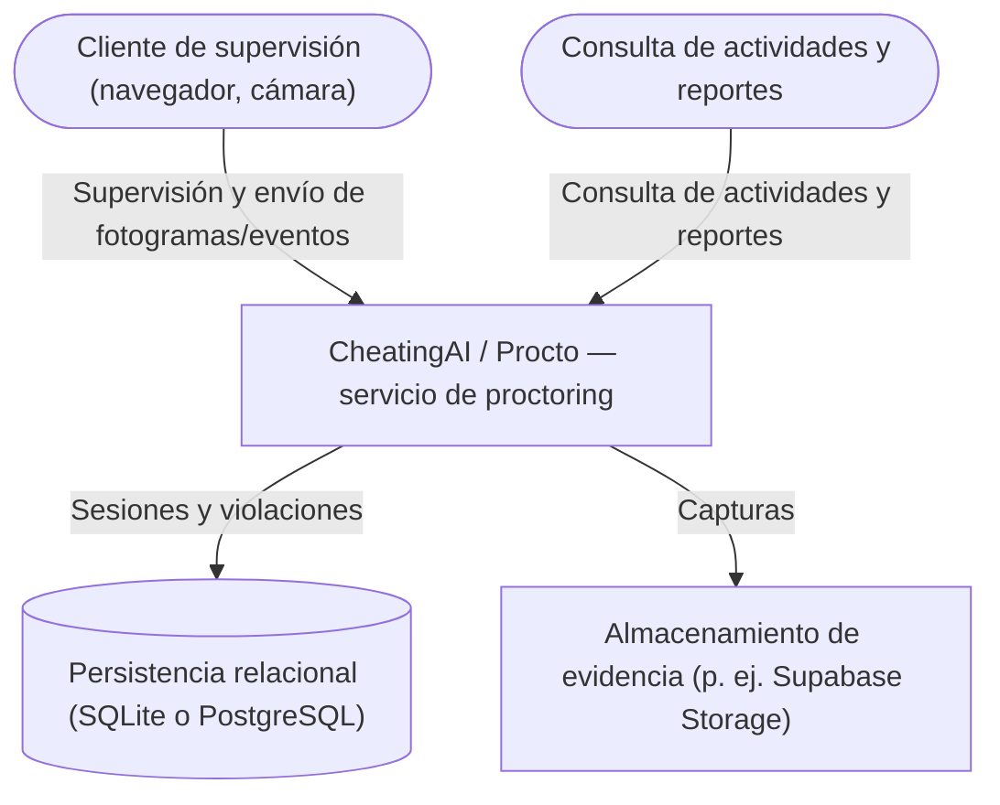
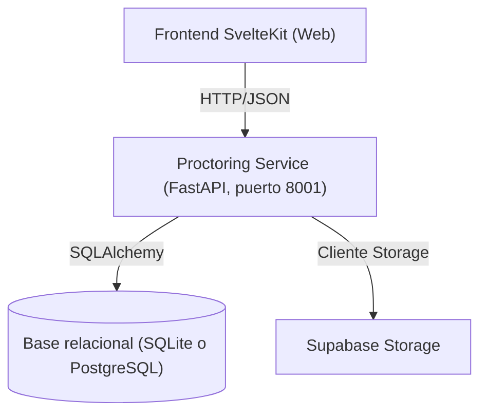

# INFORME 2 — CheatingAI / Procto

## Documentación complementaria

El presente archivo constituye el **informe principal** del entregable. En la raíz del repositorio se encuentran, como material de apoyo:

- **`ARCHITECTURE.md`**: ampliación de la arquitectura según el modelo C4, con diagramas y niveles de detalle adicionales frente al resumen incluido en las secciones de diseño de este documento.
- **`CRITERIOS_DE_RIESGO.md`**: criterios, reglas y parámetros vinculados al motor de evaluación de riesgo (scoring) de las sesiones de supervisión.

Se recomienda leer primero el cuerpo de este informe; posteriormente pueden consultarse los archivos anteriores cuando se requiera mayor profundidad en arquitectura o en la definición operativa del riesgo.

## Introducción

CheatingAI (nombre de trabajo; en el cronograma se contempla el rebranding a **Procto**) es un sistema orientado a apoyar la supervisión académica y la detección de irregularidades en **evaluaciones virtuales** mediante **supervisión por cámara y navegador (proctoring)**: análisis de fotogramas y eventos del navegador para registrar comportamientos sospechosos durante un examen, almacenarlos como evidencia y generar reportes comprensibles para la revisión académica.

La **comparación de similitud de código** y la integración con un módulo externo dedicado a ello **quedan fuera del alcance** de esta entrega del proyecto final; una eventual integración futura no forma parte del trabajo aquí documentado.

### Situación actual

El sistema cuenta con una implementación funcional del servicio de proctoring que permite:

- Iniciar y finalizar sesiones de supervisión asociadas a examen y a `student_id`.
- Analizar fotogramas periódicos desde el navegador y detectar señales de riesgo (presencia/ausencia de persona, múltiples personas, mirada desviada, teléfono).
- Registrar eventos del navegador (cambio de pestaña y pérdida de foco) como violaciones con marca de tiempo.
- Almacenar **capturas de evidencia** en **Supabase Storage** cuando se detecta una violación (si la integración está configurada).
- Generar un **reporte por sesión** con score de riesgo (0–100), nivel (bajo/medio/alto/crítico), alertas en lenguaje natural y agrupación de “picos” de comportamiento (clusters).
- Listar resúmenes por examen, sesiones por examen y obtener informe detallado por sesión mediante la API de sesiones.

### Necesidad u oportunidad

En contextos de evaluación remota, el control humano directo se vuelve limitado. La oportunidad consiste en producir:

- **Evidencia concreta** (eventos con timestamp y capturas) para revisión posterior.
- **Señales interpretables** (score y alertas) que acorten el tiempo dedicado al análisis manual.
- Un enfoque de detección que no dependa exclusivamente de bloqueo del navegador o grabaciones extensas, sino que integre señales de cámara, navegador y patrones de comportamiento.

---

## Planteamiento del Problema

### a) Descripción del problema

En evaluaciones virtuales, el riesgo de fraude aumenta por factores como:

- Acceso paralelo a recursos externos (pestañas/ventanas adicionales, aplicaciones externas).
- Presencia de terceros durante la evaluación.
- Sustitución de identidad (una persona diferente realizando el examen).
- Uso de dispositivos móviles como fuente de consulta.

La problemática incide principalmente en:

- **La revisión académica**, que requiere evidencia y señales claras para fundamentar decisiones.
- **Las instituciones**, que necesitan reducir riesgo reputacional y asegurar integridad académica.
- **La equidad del proceso evaluativo**, que exige reglas explícitas y mecanismos que minimicen falsos positivos.

Consecuencias principales:

- Procesos de revisión manual lentos y poco consistentes.
- Reportes “triviales” con datos crudos que no se traducen en decisiones.
- Riesgo de falsos positivos (alertas excesivas o no concluyentes) que deterioran la confianza y la experiencia de uso del sistema.

### b) Restricciones y supuestos de diseño

Restricciones y condiciones observadas en el proyecto:

- **Ejecución en CPU** (sin requerir GPU) para facilitar adopción.
- Dependencia de **Web APIs** del navegador para captura de cámara y eventos de ventana/pestaña.
- Sensibilidad del desempeño a condiciones reales: iluminación, calidad de cámara, ángulos del rostro, accesorios (gafas, mascarillas).
- Requerimientos de **privacidad**: evitar almacenar video completo; preferir eventos y evidencia puntual.
- Integraciones externas (p. ej. Supabase Storage) sujetas a límites de costo, políticas de acceso y configuración de seguridad.
- En el **servicio de proctoring**, el motor de visión (MediaPipe) impone ejecutar la API con **un solo worker** de Uvicorn para evitar problemas de estado no seguros ante `fork`.

Supuestos:

- Disponibilidad de un navegador moderno compatible con `getUserMedia` en el cliente de supervisión.
- Conectividad estable hacia la infraestructura desplegada.
- Interpretación de reglas e indicadores como apoyo a la decisión humana, no como sanción automática.

### c) Alcance

Dentro del alcance (implementación actual y roadmap inmediato del proctoring):

- Supervisión por cámara: detección de señales de riesgo y registro de violaciones.
- Captura y almacenamiento de evidencia puntual (fotogramas) ante violaciones.
- Reporte por sesión con score de riesgo y explicaciones legibles.
- Detección de cambio de pestaña/ventana y pérdida de foco como señales de riesgo.
- Registro y comprobación periódica de identidad por sesión (cuando está habilitado en el flujo).

Fuera del alcance (en esta entrega):

- **Comparación de similitud de código** y análisis batch asociados; cualquier integración posterior con un servicio dedicado a plagio se considera **línea de trabajo independiente**.
- Integración con LMS (Moodle/Canvas) como plataforma oficial de evaluación.
- Sanción o intervención automática (expulsión/bloqueo) sin revisión humana.
- Detección confiable de **múltiples monitores físicos** únicamente con navegador (limitación técnica; se planifican mitigaciones).
- Análisis del contenido exacto de pantalla capturada por el cliente de supervisión (salvo que se implemente screen sharing y políticas asociadas explícitas).

El repositorio puede contener **otros servicios** en Docker Compose (por ejemplo, API y colas orientadas a otras funcionalidades) que **no se documentan** en este informe por no pertenecer al alcance del proyecto final descrito.

---

## Objetivos

### Objetivo general

Desarrollar un sistema que apoye la integridad académica en evaluaciones virtuales mediante **supervisión por cámara y navegador**, generando evidencia y reportes accionables para la supervisión y la revisión.

### Objetivos específicos (medibles)

- **OE-01**: Registrar sesiones de examen con `exam_id`, `student_id`, inicio/fin y estado (activo/finalizado).
- **OE-02**: Analizar fotogramas periódicos y detectar al menos: ausencia de persona, múltiples personas, mirada desviada y teléfono visible.
- **OE-03**: Registrar eventos del navegador (cambio de pestaña, pérdida de foco) con timestamp durante una sesión activa.
- **OE-04**: Almacenar evidencia puntual (captura) cuando se detecten violaciones y asociarla al evento.
- **OE-05**: Generar reportes por sesión con resumen (conteos), lista de eventos, evidencia y una evaluación de riesgo 0–100.
- **OE-06**: Proveer una interfaz web que permita supervisión en vivo, vista de actividades por examen y reporte detallado por sesión (incluida la vinculación a `student_id` donde corresponda).
- **OE-07**: Reducir falsos positivos mediante umbrales calibrables, reglas de supresión de alertas triviales y mecanismos de revisión humana.

---

## Estado del Arte

El proctoring remoto ha sido abordado mediante soluciones comerciales y enfoques académicos. Se identifican patrones comunes:

### 1) Soluciones comerciales de proctoring

Ejemplos representativos: **Proctorio**, **Respondus LockDown Browser**, **Honorlock**, **Examity**.

Características frecuentes:

- Bloqueo del navegador (restricción de pestañas, pantalla completa).
- Monitoreo por webcam y/o grabación de pantalla.
- Reportes con banderas/flags y revisión posterior (en algunos casos con revisión humana).

Limitaciones típicas:

- Dependencia de políticas intrusivas (grabación extendida, bloqueo estricto) con fricción en la experiencia de uso.
- Riesgo de falsos positivos cuando se aplican reglas rígidas sin contextualización.
- Costos recurrentes por cuenta o por examen.

### 2) Enfoques académicos

En literatura es común encontrar:

- Detección de mirada, presencia, objetos y postura con modelos de visión por computador.
- Fusión de señales (reglas + estadística/ML) para inferir riesgo.
- Mecanismos “human-in-the-loop” para revisión y retroalimentación.

Oportunidades identificadas:

- Convertir datos crudos en **alertas accionables** (explicabilidad).
- Diseñar reportes que eviten trivialidad: score, razones principales, evidencia y agrupación temporal.
- Minimizar almacenamiento de datos sensibles (evidencia puntual en lugar de video completo).

### Tabla comparativa (resumen)

| Enfoque | Señales principales | Evidencia típica | Privacidad (orden de magnitud) | Costo | Despliegue |
|---|---|---|---|---|---|
| Proctoring comercial (bloqueo + grabación) | Navegador + webcam | Video / pantalla completa | Alta intrusión | Recurrente | SaaS |
| Proctoring comercial (eventos + flags) | Navegador + webcam | Eventos + clips o capturas | Variable | Recurrente | SaaS |
| Enfoque propuesto (CheatingAI / Procto) | Cámara + eventos de foco/pestaña + score | Eventos + capturas puntuales | Menor intrusión (sin video completo) | Controlable (según servicios elegidos) | Docker + servicios gestionados opcionales |

---

## Requerimientos

### a) Funcionales

- **RF-01**: Iniciar sesión de supervisión asociada a `exam_id` y `student_id`.
- **RF-02**: Finalizar sesión y generar resumen por tipo de violación.
- **RF-03**: Analizar fotogramas y detectar: `no_person`, `multiple_persons`, `looking_away`, `phone_detected`.
- **RF-04**: Registrar violaciones con timestamp y nivel de confianza.
- **RF-05**: Registrar eventos del navegador: `tab_switch` y `window_blur`.
- **RF-06**: Almacenar capturas de evidencia ante violaciones en un sistema de almacenamiento de objetos y asociar URL al evento cuando la subida se complete correctamente.
- **RF-07**: Listar exámenes con conteo de participantes (`student_id`) y actividad reciente.
- **RF-08**: Listar sesiones por examen con estado y timestamps.
- **RF-09**: Generar reporte detallado por sesión con:
  - resumen de eventos,
  - evidencia,
  - score de riesgo (0–100),
  - nivel y alertas explicadas.
- **RF-10**: Registrar identidad de referencia por sesión y ejecutar chequeos periódicos (cuando esté habilitado en el flujo).

### b) No funcionales

- **RNF-01 Rendimiento**: procesamiento de fotogramas con latencia estable en CPU; frecuencia configurable en el cliente (p. ej. cada 2 s).
- **RNF-02 Escalabilidad**: soporte para múltiples sesiones concurrentes mediante base de datos relacional; el servicio de visión se despliega con un proceso de aplicación acorde a las limitaciones del stack de MediaPipe.
- **RNF-03 Seguridad**: separación de credenciales en variables de entorno (p. ej. archivo `.env` no versionado), rotación de claves y configuración de políticas de acceso en base de datos y almacenamiento de objetos cuando aplique (RLS, bucket privado, URLs firmadas).
- **RNF-04 Privacidad**: evitar almacenamiento de video completo; privilegiar evidencia puntual (capturas) y retención limitada.
- **RNF-05 Usabilidad**: reportes comprensibles y priorizados (sin trivialidad); interfaz clara para supervisión y revisión.
- **RNF-06 Mantenibilidad**: modularidad (servicios, routers, esquemas) y documentación técnica de arquitectura (C4).
- **RNF-07 Confiabilidad**: manejo de errores y degradación segura (si falla el almacenamiento de evidencia, el sistema puede continuar registrando eventos según la lógica implementada).
- **RNF-08 Calidad**: minimizar falsos positivos mediante umbrales calibrables y reglas de supresión de eventos triviales.

---

## Diseño y Arquitectura

### a) Evaluación de alternativas

Decisiones evaluadas en el proyecto (ámbito proctoring):

- **Base de datos relacional**:
  - SQLite: adecuado para desarrollo y despliegues simples; limitaciones de concurrencia en escenarios muy exigentes.
  - PostgreSQL: opción de producción; el servicio admite `DATABASE_URL` con PostgreSQL (p. ej. instancia gestionada).
- **Almacenamiento de evidencia (objetos)**:
  - MinIO u otro compatible S3: alternativa auto-hospedada.
  - Supabase Storage: servicio gestionado adoptado en la implementación para simplificar despliegue y evidencia.
- **Modelos de visión**:
  - OpenCV clásico frente a MediaPipe: se prioriza MediaPipe por modelos optimizados y pipeline reproducible en CPU, con detector de objetos ligero para teléfono (p. ej. EfficientDet-Lite en TFLite).
- **Proceso de aplicación del servicio de visión**:
  - Múltiples workers frente a un solo worker Uvicorn: se adopta **un worker** por las limitaciones de fork-safety del estado nativo de MediaPipe en el proceso.

### b) Arquitectura seleccionada

La arquitectura sigue el modelo **C4**. A continuación se incluye un resumen de dos niveles (Contexto y Contenedores) alineado con el **subsistema de proctoring** documentado en este informe.

#### Diagrama de contexto (alto nivel)

#### Diagrama de contenedores (implementación — proctoring)

La base relacional corresponde al valor configurado en `DATABASE_URL` del servicio (por defecto SQLite en el contenedor de desarrollo).

Justificación resumida:

- Un servicio dedicado concentra visión, reglas de violación y reportes de sesión.
- Evidencia en almacenamiento de objetos permite reportes verificables sin almacenar video completo.
- El frontend se comunica solo con el servicio de proctoring para las funcionalidades descritas en este documento.

---

## Implementación (avance actual)

### a) Stack tecnológico (resumen)

- **Backend (proctoring)**: Python + FastAPI + SQLAlchemy + Pydantic.
- **Proctoring (visión)**: MediaPipe + OpenCV + modelos ligeros; verificación de identidad basada en embeddings (DeepFace, importación diferida cuando se utiliza).
- **Frontend**: SvelteKit en el directorio `client/` (captura de cámara, polling, vistas de supervisión, actividades y reporte).
- **Infraestructura**: Docker Compose; contenedor `proctoring` según `docker/Dockerfile.proctoring` (Uvicorn en puerto **8001**, un worker).
- **Servicios externos**: Supabase Storage para capturas; opcionalmente base PostgreSQL gestionada si se configura la URL de base de datos.

### b) Componentes implementados e interacción

**API de proctoring** (`proctoring_service`, prefijo `/api/v1`):

- `POST /proctoring/analyze-frame`: analiza un fotograma, devuelve violaciones detectadas y, con `session_id` y sesión activa, persiste violaciones y sube evidencia cuando corresponde.
- `POST /proctoring/browser-event`: registra `tab_switch` u `window_blur` como violación.
- `POST /proctoring/register-identity` y `POST /proctoring/check-identity`: referencia facial y comprobación con registro de `identity_mismatch` si aplica.
- `POST /proctoring/calibrate`: expone valores crudos de mirada y umbrales para ajuste (sin lógica de violación de negocio en la respuesta).

**API de sesiones** (mismo servicio, prefijo `/api/v1`):

- `POST /sessions/`: creación de sesión.
- `GET /sessions/exams-summary`: listado de exámenes con conteos.
- `GET /sessions/by-exam/{exam_id}`: sesiones por examen.
- `GET /sessions/{session_id}`: resumen y conteos por tipo de violación.
- `GET /sessions/{session_id}/report`: informe detallado con evaluación de riesgo.
- `PUT /sessions/{session_id}/end`: cierre de sesión.

**Persistencia y riesgo:**

- Almacenamiento de URL de evidencia en el registro de violación (`frame_snapshot`) cuando la subida a Storage tiene éxito.
- Motor de riesgo: score 0–100, nivel, alertas explicadas y clusters temporales en el reporte.

**Frontend:**

- Flujo de supervisión por cámara: captura periódica de fotogramas, registro de eventos de navegador, soporte de identidad cuando se activa, vista de actividades por examen y reporte detallado por sesión.

### c) Integraciones

- **Base de datos relacional**: persistencia de sesiones y violaciones vía SQLAlchemy; por defecto SQLite en el contenedor de desarrollo; configurable a PostgreSQL.
- **Supabase Storage**: almacenamiento de capturas asociadas a sesión y tiempo; depende de variables de entorno de servicio y bucket configurado.
- **Redis, Celery y Flower** en el mismo repositorio: utilizados por **otros** servicios del compose orientados a funcionalidad **ajena** al alcance de este informe; el contenedor `proctoring` no los requiere para operar.

Información sensible:

- Credenciales y URLs privadas se gestionan mediante variables de entorno y no deben incluirse en documentación pública.

---

## Plan de pruebas

### a) Pruebas por componentes (unitarias / por módulo)

**Visión y reglas:**

- Detección de rostro:
  - Caso de éxito: `no_person` cuando no hay rostro; `multiple_persons` cuando hay más de uno.
- Estimación de mirada:
  - Caso de éxito: `looking_away` cuando se superan umbrales configurados.
- Detección de teléfono:
  - Caso de éxito: `phone_detected` cuando el objeto aparece con certeza suficiente.
- Motor de riesgo:
  - Caso de éxito: score y alertas coherentes ante combinaciones de eventos (p. ej. teléfono + desajuste de identidad → nivel crítico).

Criterios de éxito:

- Salidas deterministas en pruebas controladas.
- Cobertura de casos típicos y casos borde (frames vacíos, baja resolución, etc.).

### b) Pruebas de integración (flujos completos)

Flujos representativos:

1. **Supervisión completa**:
   - iniciar sesión → analizar frames → registrar violaciones → subir evidencia → finalizar sesión → consultar reporte.
2. **Eventos del navegador**:
   - iniciar sesión → perder foco o cambiar pestaña → registrar `window_blur` / `tab_switch` → verificar aparición en reporte.
3. **Identidad**:
   - iniciar sesión → registrar identidad → ejecutar chequeos periódicos → registrar `identity_mismatch` ante discrepancia simulada.

Criterios de aceptación:

- Endpoints responden con códigos HTTP esperados.
- Persistencia correcta (sesiones, eventos, URLs de evidencia cuando Storage está operativo).
- Reporte refleja la información registrada (conteos, evidencias, score).

**Manejo de errores (integración):**

- Respuesta coherente ante sesión inexistente o no activa en rutas que lo exigen.
- Comportamiento definido ante fallo de decodificación de imagen o datos base64 inválidos en `analyze-frame`.
- Cuando el almacenamiento de evidencia no está disponible o falla, verificar que el registro de eventos o la API sigan un comportamiento acorde a la implementación (p. ej. continuación sin URL de captura).

### c) Pruebas de usabilidad

Objetivo: evaluar claridad del reporte y fricción en el flujo de supervisión.

Metodología sugerida:

- Conformar un panel reducido de evaluación con escenarios que cubran el rol de supervisión activa y el de revisión de resultados; asignar tareas:
  - iniciar sesión, ejecutar una supervisión, finalizar, localizar el reporte.
  - interpretar score y alertas; localizar evidencia.
- Medir:
  - tiempo promedio para completar tareas,
  - número de errores o confusiones,
  - satisfacción percibida (escala 1–5),
  - claridad de los mensajes del reporte.

Criterios de aceptación:

- El reporte permite identificar de forma expedita qué ocurrió y por qué es relevante, sin depender de lectura extensa de registros técnicos.
- El sistema no genera alertas triviales en escenarios normales de uso y admite revisión humana ante incertidumbre.
